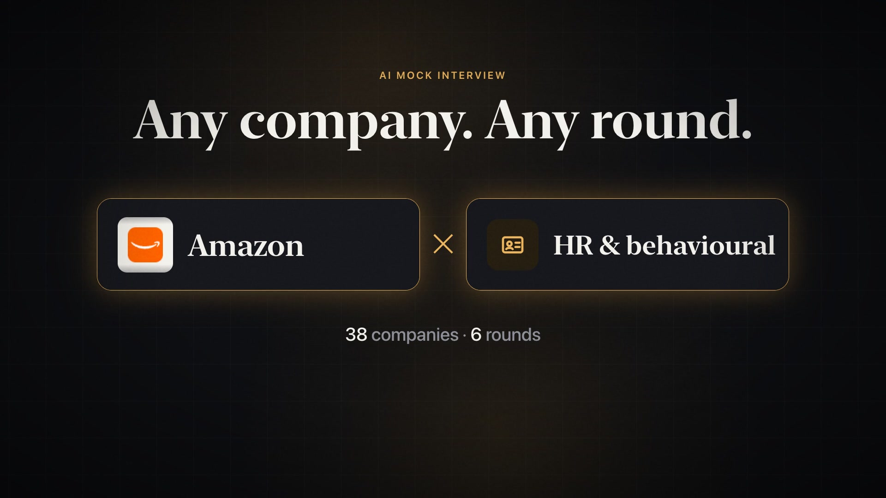
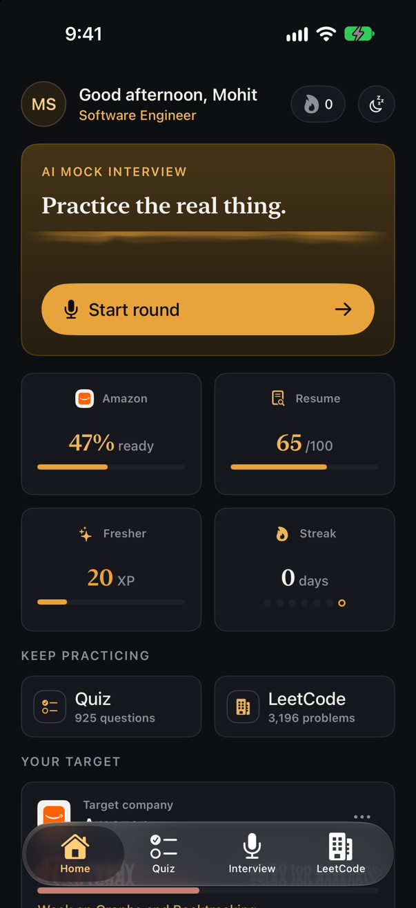
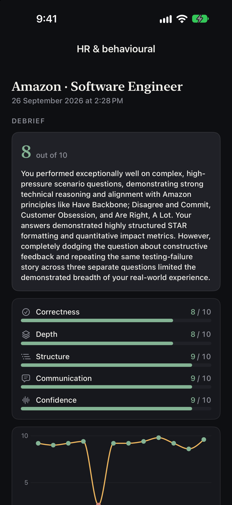
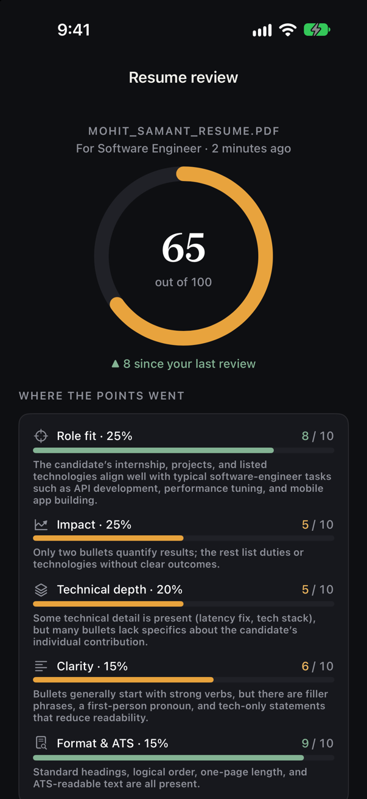

# PPIP: Placement Preparation Intelligence Platform

**PlacementPrep** is an iOS, iPadOS and Mac Catalyst app for campus placement preparation, backed by a FastAPI service. It combines:

- **Topic-wise quizzes**: aptitude, core CS, DSA and role-specific question sets, with an AI-written summary of how you did.
- **Company DSA question banks** for about 40 companies (Google, Amazon, Microsoft, Flipkart, Zomato, Goldman Sachs and others), with solved and saved tracking.
- **AI mock interviews** you can answer by voice. Rounds adapt their difficulty to your answers and end with written feedback.
- **Progress and motivation**: XP levels, daily streaks, a dashboard, and app icons you unlock as you level up.

## Demo

[](docs/media/demo.mp4)

<p align="center">
  
  &nbsp;
  
  &nbsp;
  
</p>

## Features

### Quizzes
Bundled JSON quiz sets live in `frontend/PlacementPrep/Resources/Quizzes/`:

| Track | Sets |
| --- | --- |
| Aptitude | Quantitative, logical, verbal |
| Core CS | Operating systems, DBMS, computer networks, system design, general CS |
| DSA | Data structures, algorithms, mixed |
| Roles | Backend/web, frontend, mobile, data/ML, DevOps/cloud, cyber security, embedded, Java/Spring, Python, QA |

Results are stored per user. The backend can also generate an AI summary of a finished quiz.

### Company DSA lists
Per-company CSVs (`Resources/Companies/`) and logos (`Resources/Logos/`) ship with the app. You can search, filter, mark questions solved (synced to the backend) and save questions for later.

### AI mock interviews
- **Six round types**: HR, tech stack, core CS, projects, panel debate, and DSA approach.
- **Adaptive difficulty**: each round opens with calibration questions, then moves up or down a five-level ladder based on how accurate and how fluent your answers are. A round runs for 10 to 50 questions.
- **Company-style rounds**: pick a company (defaults to your target company) and the rounds imitate its interviews. HR questions are aimed at its published values (Amazon's Leadership Principles, for example), DSA draws from its most-asked problems, and the other rounds are pitched at its bar. The feedback judges you against the same values. Company values and interview expectations live in `backend/app/content/data/expected_qualities.json`.
- **Resume-aware**: you can attach a resume (PDF or text) during onboarding. The app extracts the text, and the backend summarizes your projects so questions can be tailored to them.
- **Voice input**: hold to talk. Groq Whisper (`whisper-large-v3-turbo`) transcribes the audio.
- **Feedback and history**: each round ends with a rating, a five-part rubric (correctness, depth, structure, communication, confidence) for the round and for every answer, a chart of your scores across the round, and suggestions. You can reopen past sessions with full transcripts, each answer marked with its score.

### Resume review
- Upload a resume (PDF or image) and get a score out of 100 for your target role, built from five weighted factors: role fit, impact, technical depth, clarity, and format & ATS.
- Screening checks run in code: whether applicant-tracking software can read the file, contact details, length, section headings, numbers in bullets, action verbs and first-person pronouns.
- Improvements are prioritised, and up to three of your weakest bullets are rewritten. A rewrite must quote your resume exactly, and any number it needs is left as a `[placeholder]` for you to fill in.
- The file is read on the device. Email, phone, links and (best effort) your name are removed before the text is sent, the endpoint stores nothing, and review history stays on the phone.

### Progress and personalization
- **XP levels**: Fresher → Shortlisted → Screened → Interviewing → Final Round → Placed. Each level unlocks an alternate app icon.
- Daily streaks and a dashboard.
- **Focus mode**: keeps the screen awake while you practise.
- A theme picker and a custom design system (`PP*` components, including a Metal liquid-wave shader).

### Accounts
Email sign-up with OTP verification (sent through Resend), plus Google and GitHub OAuth. Auth uses JWT bearer tokens, and the app keeps them in the Keychain.

## Tech stack

| Layer | What it uses |
| --- | --- |
| App | SwiftUI (iOS 17+, iPadOS, Mac Catalyst), Observation, Metal. No third-party dependencies. The Xcode project is generated with [XcodeGen](https://github.com/yonaskolb/XcodeGen). |
| API | Python 3.10+, FastAPI, Uvicorn, Pydantic Settings |
| Data | SQLModel on SQLite by default (any SQLAlchemy URL works via `DATABASE_URL`) |
| Auth | PyJWT, passlib/bcrypt, Resend (email OTP), Google and GitHub OAuth |
| AI | Groq (default `openai/gpt-oss-120b`, with fallbacks) and/or Google Gemini (`gemini-flash-latest`, with fallbacks); Groq Whisper for speech-to-text |
| Deploy | Docker + Fly.io (`bom` region, persistent volume for SQLite) |

## Repository layout

| Path | What it is |
| --- | --- |
| `frontend/` | SwiftUI app. Source is in `PlacementPrep/` (App, DesignSystem, Models, Services, ViewModels, Views, Resources); `project.yml` is the XcodeGen spec; `Scripts/` holds content and packaging tools. |
| `backend/app/` | FastAPI service: `auth/` (JWT, OTP, OAuth), `ai/` (interview rounds, difficulty, prompts, LLM calls), `content/` (quiz, DSA, company routes), `core/config.py` (settings). |
| `backend/scripts/` | Maintenance scripts (`wipe_database.py`). |
| `database/` | SQLModel table models (`user`, `quiz`, `dsa`, `interview`) and the engine/session, shared with the backend. |
| `Dockerfile`, `fly.toml` | Container image and Fly.io config for the backend. |

## Running the backend

Requires Python 3.10+. Run these from `backend/`:

```bash
cd backend
python3 -m venv .venv && source .venv/bin/activate
pip install -r requirements.txt
cp .env.example .env
uvicorn app.main:app --reload --port 8000
```

- Interactive API docs: http://localhost:8000/docs
- Health check: http://localhost:8000/health
- Tables are created automatically on startup.
- Tests: `PYTHONPATH=..:. python -m unittest discover -s tests`

### Configuration (`backend/.env`)

| Variable | Purpose |
| --- | --- |
| `DATABASE_URL` | Defaults to `sqlite:///./placement_prep.db` |
| `JWT_SECRET_KEY` | **Required.** Set it to a long random string. |
| `JWT_ALGORITHM`, `ACCESS_TOKEN_EXPIRE_MINUTES` | Token settings (HS256, 24 h by default) |
| `GROQ_API_KEY`, `GROQ_MODEL`, `GROQ_FALLBACK_MODELS` | Groq LLM, also used for voice transcription |
| `GEMINI_API_KEY`, `GEMINI_MODEL`, `GEMINI_FALLBACK_MODELS` | Gemini LLM |
| `RESEND_API_KEY`, `EMAIL_FROM` | Sends verification emails. If unset, no email is sent. |
| `DEV_VERIFICATION_CODE` | Fixed OTP for local development (`123456`). Leave it empty in production. |
| `GOOGLE_CLIENT_ID/SECRET`, `GITHUB_CLIENT_ID/SECRET` | OAuth sign-in stays disabled until these are set. |
| `OAUTH_REDIRECT_BASE` | Public base URL used for OAuth callbacks |
| `CORS_ORIGINS` | JSON list of allowed origins |

Set at least one of `GROQ_API_KEY` or `GEMINI_API_KEY` for the AI features to work. Voice input needs `GROQ_API_KEY`.

### API overview

| Prefix | Endpoints |
| --- | --- |
| `/api/auth` | `signup`, `verify`, `resend-verification`, `login`, `GET`/`PATCH me` |
| `/api/auth/oauth` | `{provider}/login`, `{provider}/callback` (`google`, `github`) |
| `/api/quiz` | `questions`, `submit`, `summary`, `history`, `progress` |
| `/api/dsa` | `GET`/`POST solved`, `DELETE solved/{slug}` |
| `/api/companies` | list, `{slug}` |
| `/api/interview` | `start`, `respond`, `transcribe`, `resume-summary`, `{id}/feedback`, list, `{id}` |
| `/api/resume` | `review` |

### Resetting the database

```bash
python3 scripts/wipe_database.py        # dry run: lists row counts
python3 scripts/wipe_database.py --yes  # deletes every row
```

## Running the app

Requires Xcode 15+ and XcodeGen (`brew install xcodegen`).

```bash
cd frontend
xcodegen generate            # re-run after adding, removing or renaming files
open PlacementPrep.xcodeproj
```

Pick an iPhone or iPad simulator, or **My Mac (Mac Catalyst)**, then run. For a physical device, set your development team in Signing & Capabilities.

The app talks to `http://localhost:8000` by default. To use a different backend, set the `PPBackendURL` user default, for example:

```bash
xcrun simctl spawn booted defaults write com.placementprep.app PPBackendURL https://placementprep-api.fly.dev
```

### Packaging for macOS

```bash
./Scripts/package-mac.sh
```

This builds a Release Mac Catalyst archive and a `.dmg` in `frontend/build/mac/`. Set `DEVELOPER_ID` (and optionally `NOTARY_PROFILE`) to sign and notarize it. Without them, the app is left unsigned.

### Content scripts

Quiz and company content ships in the app bundle. Regenerate it with the scripts in `frontend/Scripts/`:

```bash
python3 Scripts/validate-quizzes.py      # run after editing any quiz JSON
python3 Scripts/shuffle-quiz-answers.py  # re-deal a quiz's answer key if validation flags a pattern
python3 Scripts/build-company-csvs.py    # refresh Resources/Companies/*.csv from every public source
./Scripts/fetch-company-csvs.sh          # seed a brand-new company from the raw upstream snapshot
python3 Scripts/fetch-company-logos.py   # refresh Resources/Logos/*.png
```

`Scripts/companies-not-bundled.txt` lists the companies that are deliberately left out of the bundle.

`build-company-csvs.py` merges LeetCode company tags from five public repos, GeeksforGeeks company
tags (mapped through the hand-checked `Scripts/gfg-leetcode-equivalents.json`) and, for companies
with under 100 problems, LeetCode Discuss interview posts. It re-tags every row from LeetCode's live
catalog and never drops a bundled row. Problems with no current LeetCode frequency get `0`, so they
show without a "Freq" badge after the tagged ones. Pass `--dry-run` to see the counts first.

## Deploying the backend

The backend deploys to Fly.io from the **repo root**, because the image needs both `backend/` and `database/`:

```bash
fly volumes create placementprep_data --region bom   # first time only
fly secrets set JWT_SECRET_KEY=... GROQ_API_KEY=... GEMINI_API_KEY=... RESEND_API_KEY=... DEV_VERIFICATION_CODE=
fly deploy
```

SQLite lives on the mounted volume at `/data/placement_prep.db`. Machines auto-stop when idle and start on request, and `/health` is used for health checks. Keep secrets in `fly secrets`, never in `fly.toml`.
